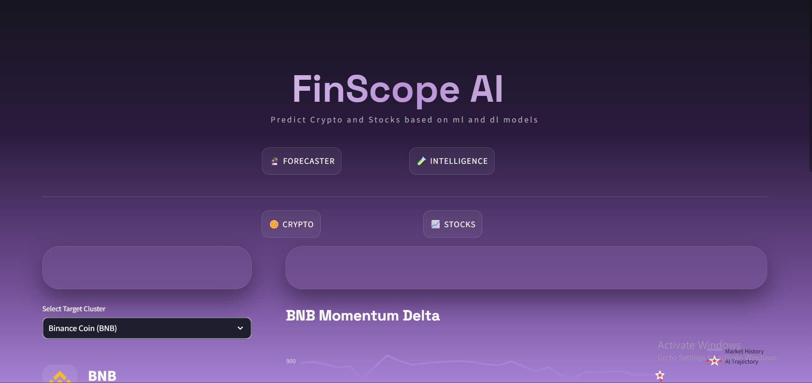
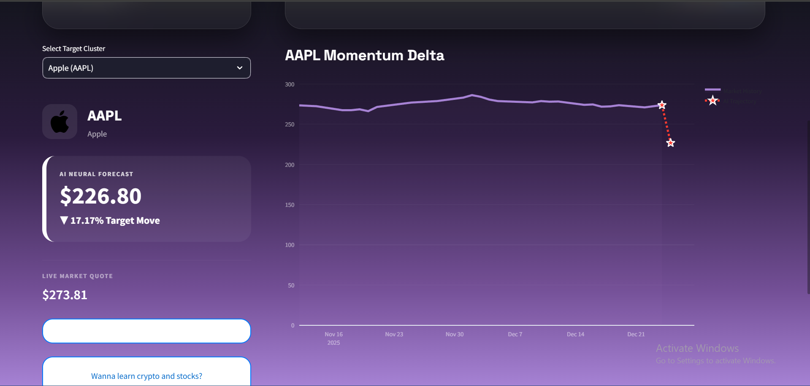
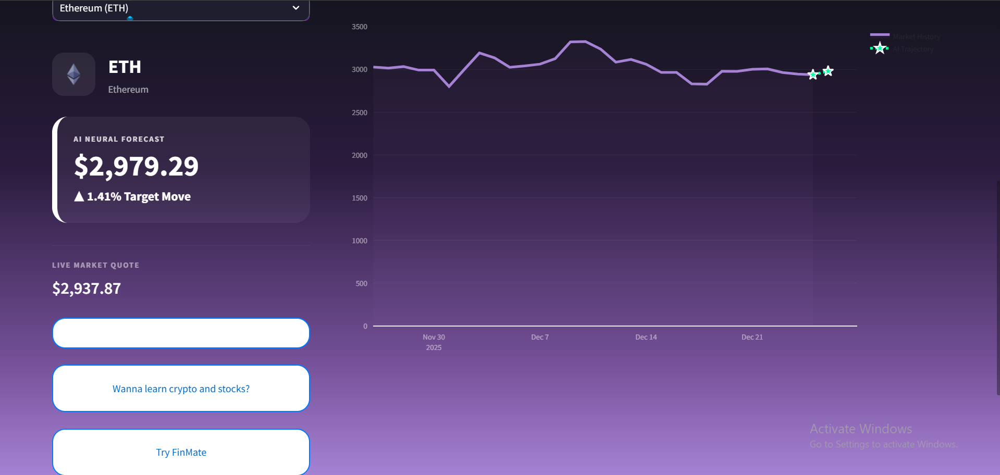

# FinScope AI 🚀

**FinScope AI** is a professional-grade market intelligence tool providing real-time price predictions for **Top 5 Cryptocurrencies** and **Top 5 Tech Stocks**.

Designed with a premium glassmorphism UI, it leverages specialized XGBoost models trained on over 10 years of historical data (2015–2025) to deliver neural price forecasts and market sentiment logic.

---

## 📈 Stock Market Intelligence

We track the "Magnificent 5" tech giants, providing momentum analysis and price targets based on advanced regression models.

### Top Stock Performance
| Asset | Accuracy | Neural Insight |
| :--- | :--- | :--- |
| **Microsoft (MSFT)** | **96.04%** | Enterprise Multiplier Weighting |
| **Google (GOOGL)** | **93.99%** | Search Velocity Integration |
| **Tesla (TSLA)** | **86.87%** | Retail Sentiment Volatility |
| **Apple (AAPL)** | **86.60%** | Stable Growth Trajectory |
| **Amazon (AMZN)** | **85.84%** | Commerce Volume Sensitivity |

---

## 🪙 Cryptocurrency Intelligence

Our crypto engine handles high-volatility assets by using log-transformed feature inputs, ensuring stability even during massive market swings.

### Top Crypto Performance
| Asset | Accuracy | Model Architecture |
| :--- | :--- | :--- |
| **Ethereum (ETH)** | **95.88%** | XGB-500e/6d |
| **Solana (SOL)** | **93.62%** | XGB-500e/6d |
| **Binance Coin (BNB)** | **88.96%** | XGB-500e/6d |
| **Bitcoin (BTC)** | **70.10%** | XGB-500e/6d |
| **Dogecoin (DOGE)** | **57.08%** | XGB-500e/6d |

---

## ⚠️ Honesty & Future Work

While the **Price Accuracy** (the % difference between predicted and actual price) is high for stable assets, we must be transparent about the model's predictive power:

1.  **Low R² Scores**: The current R² (Coefficient of Determination) scores are very low, specifically for volatile assets like Dogecoin and Bitcoin. The models struggle to capture the *variance* of the market perfectly.
2.  **Overfitting Risks**: High accuracy on "Close" prices can sometimes indicate the model is simply mirroring the previous day's price (Lag-1 dominance).
3.  **Future Improvement**: For V5.0, we plan to implement **LSTM (Long Short-Term Memory)** networks and **Transformer-based Time Series** models to better capture long-term dependencies and improve the R² score significantly.

---

## 🛠️ Tech Stack
-   **Frontend**: Streamlit (Python)
-   **Machine Learning**: XGBoost (Extreme Gradient Boosting)
-   **Data Processing**: Pandas, NumPy, Scikit-Learn
-   **Visualization**: Plotly Interactive Charts

---

*FinScope AI © 2025*
